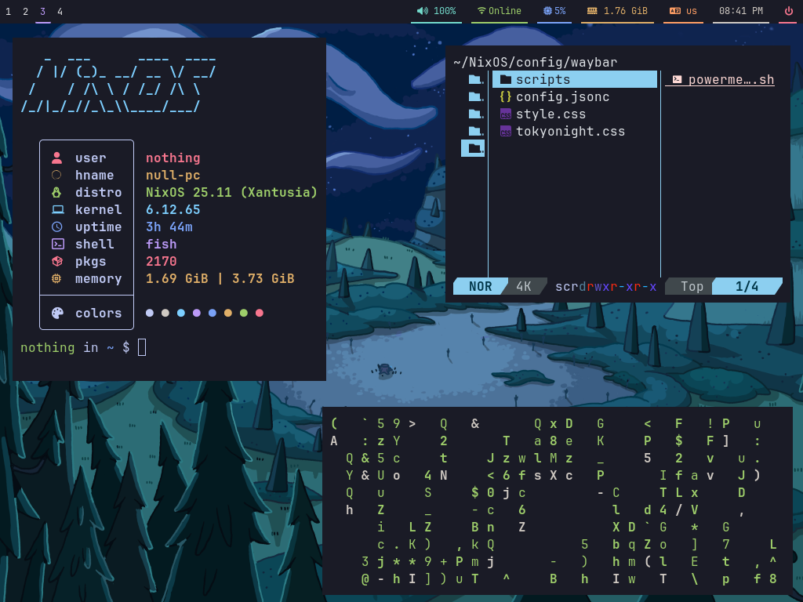
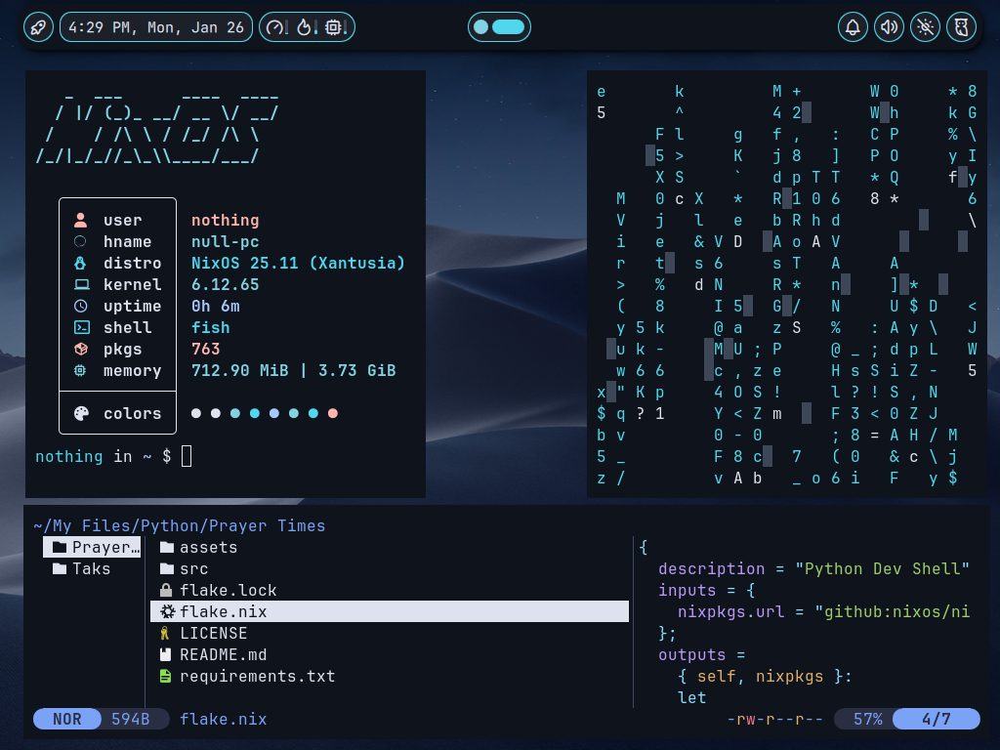

# NON-OS

NON-OS is my NixOS Configurations

(Switched to Sway, i3 files are deleted, access them by cloning then reverting to commit)
---

# Preview



---

# How To Use

- Clone this repo into your home directory

- Copy `/etc/nixos/hardware-configuration.nix` in `~/NixOS/non-os/`

- Rebuild NixOS using flakes (use your host name at the end
    
    ```bash
    sudo nixos-rebuild switch --flake ~/NixOS/non-os#host-name
    ```

    After this rebuild the command we just ran will be aliased into `nrs`

    
## Prerequisites
I use these packages so make sure that you have it installed

#### Fonts
- JetBrainsMono Nerd Font

#### Bar/WM
- Sway 
- Waybar

#### Terminal
- Foot 

#### Utilities
- btop
- grim
- slurp
- sway-contrib.grimshot 
- fish (Shell)
- Rofi (Application Launcher)

---

## Basic Keybinds

<kbd>Super + Return</kbd> -> Opens Foot 

<kbd>Super + Q</kbd> -> Closes Focused Application

<kbd>Super + D</kbd> -> Runs Rofi 

<kbd>PrtScr</kbd> / <kbd>Print</kbd> -> Takes a screenshot

---

## Using Pywal

I comment the lines that uses pywal, so all you have to do is just uncommenting them, and comment the other color comments to not override the pywal colors

in the sway configuration, pywal is active and only uses the `$wallpapers` variable, if you don't have pywal installed simply remove the include line then change the `$wallpaper` to your wallpaper path
